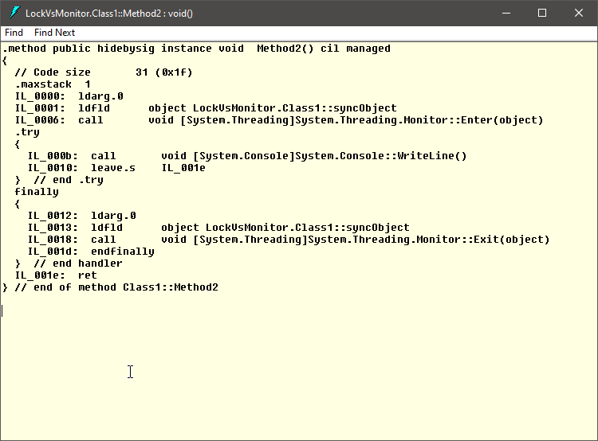
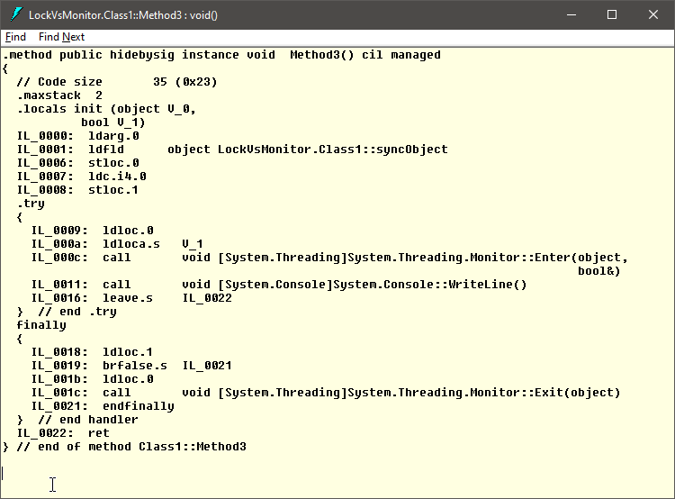

# `lock` vs `Monitor`

## Problem Description

**Concurrent access**

When there are multiple threads that must access the same resource, it is mandatory to use a synchronization mechanism, otherwise we may loose data or leave the resource in an inconsistent state.

**The `lock` statement**

The simplest synchronization mechanism provided by the C# language is the `lock` statement.

```csharp
lock (obj)
{
	// do something
}
```

But, what is under the hood of this `lock` statement? Is there something that is worth mentioning? Microsoft's documentation says that the `Monitor` class is actually used to obtain and release the lock. Is that true?

This C# Pill is aiming to answer the following question:

**Question**

- Is the `lock` statement just a syntactic sugar for the usage of `Monitor` class?

## Setup

The plan is to create two methods, one that uses the `lock` statement and one that uses the `Monitor` class to acquire the exclusive lock on on object. Then we will compare the IL code.

### The identifier

First, we need to create an object (a reference type instance) to use as identification token for the `lock` statement.

```csharp
private readonly object syncObject = new object();
```
> **Note**
>
> The lock statement does not actually prevent the modification of the instance that is provided as parameter. The instance is used like a token and only one thread at a time, from all the threads that are using the same token, is allowed to enter the `lock` block. The others must wait for the previous thread to leave the `lock` block before they can enter.

### The `lock` statement

Next, let's write a method that uses the previously created instance in a `lock` statement.

```csharp
public void Method1()
{
    lock (syncObject)
    {
        Console.WriteLine("something");
    }
}
```

> **Note**
>
> Nothing is forcing us to use the `syncObject` inside the `lock`. We just use it as an identification token.

### The `Monitor` class

Now, let's achieve the same functionality using the `Monitor` class. For a long time I thought that the implementation of the `lock` statement is like this:

```csharp
public void Method2()
{
    Monitor.Enter(syncObject);

    try
    {
        Console.WriteLine("something");
    }
    finally
    {
        Monitor.Exit(syncObject);
    }
}
```

But, after I compiled the project and opened the assembly in ILDASM, I had a surprise. It was not the same IL code. Actually, the real implementation, as specified also by Microsoft in the documentation page, is like this:

```csharp
public void Method3()
{
    object localSyncObject = syncObject;
    bool lockTaken = false;

    try
    {
        Monitor.Enter(localSyncObject, ref lockTaken);

        Console.WriteLine("something");
    }
    finally
    {
        if (lockTaken)
            Monitor.Exit(localSyncObject);
    }
}
```

**There are two differences:**

1. **`syncObject` stored locally** - The `syncObject` is stored in a local variable before it is used.
   - This makes sense, because the initial field may be changed between the `Monitor.Enter` and the `Monitor.Exit` calls.
2. **`Monitor.Enter` inside `try`** -  The call to the `Monitor.Enter` is placed inside the `try` block
   - This approach requires the creation and use of the `lockTaken` flag so that, in the end, to be able to release the lock (call `Monitor.Exit`) only if it was actually obtained in the first place.

> **Note**
>
> I do not understand why the Microsoft team decided it is better to put the `Monitor.Enter` call inside the `try` block. I find this approach more complex. It needs an additional Boolean variable and I do not see any advantage over the implementation from `Method2`.
>
> If you know one, please share it with me. Thank you :)

### The IL code

Let's build in release mode and look at the IL code using the ILDASM tool.

**Method1**


**Method2**



**Method3**



## Conclusion

The `lock` statement is indeed using the `Monitor` class to acquire and release the exclusive lock, but it is not implemented as trivial as we might think.
